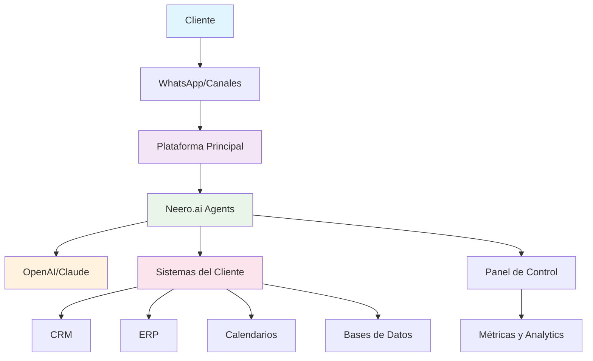
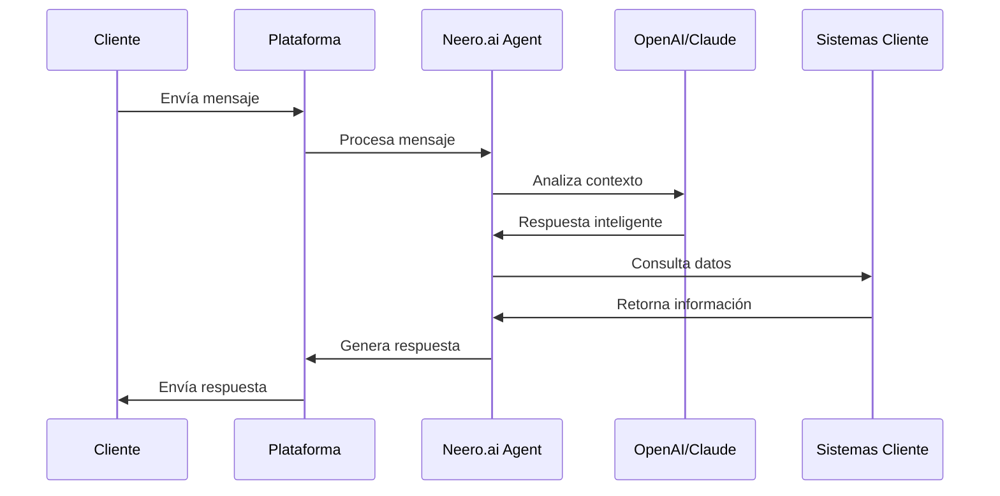

# Propuesta de Solución de IA: [Nombre del Proyecto] para [Nombre del Cliente]

---

## Información de la Propuesta

| Campo | Valor |
|-------|-------|
| **Fecha** | [Día] de [Mes], [Año] |
| **Válido hasta** | [Fecha de Vencimiento de la Propuesta] |
| **Preparado para** | [Nombre del Cliente], [Cargo del Cliente] |
| **Preparado por** | [Tu Nombre], [Tu Cargo], Neero.ai |

---

## 1. Introducción: Una Alianza Estratégica para la Excelencia Conversacional

**[Tu Empresa]**, una [descripción de tu empresa], se complace en presentar, en colaboración con **Neero.ai**, un líder en el desarrollo de agentes de **inteligencia artificial** personalizados y autónomos, una propuesta integral para transformar las operaciones de **[Nombre del Cliente]**. Nuestra alianza combina la robustez y escalabilidad de la plataforma **[Plataforma Principal]** con la inteligencia avanzada y la capacidad de decisión de los agentes de IA de **Neero.ai**, potenciados por **OpenAI**, **Anthropic Claude** y **AWS**.

Nuestro objetivo es empoderar a **[Nombre del Cliente]** para que ofrezca experiencias excepcionales a sus clientes y optimice sus procesos internos, superando las limitaciones de los chatbots genéricos y adoptando una verdadera inteligencia artificial que comprende el contexto, toma decisiones inteligentes y actúa de forma proactiva.

---

## 2. Entendiendo las Necesidades de [Nombre del Cliente]

Hemos revisado sus requisitos y comprendemos la importancia de integrar **[Plataforma Principal]** como su plataforma central de comunicación. 

Sus requisitos clave incluyen:

- Integración en tiempo real con sistemas como [Sistema 1], [Sistema 2], [Sistema 3], [Sistema 4] y [Sistema 5]
- Automatización completa de la conversión de leads para [proceso principal], desde el clic en el anuncio hasta la [acción final]
- Gestión inteligente de tickets de [tipo de servicio] a través de WhatsApp, con clasificación y enrutamiento automatizado
- Automatización de reservas de [servicio] y pagos, incluyendo la consulta de disponibilidad en tiempo real y la confirmación de pagos
- Capacidad de procesar lenguaje natural y manejar flujos de conversación complejos, incluyendo la escalada a agentes humanos cuando sea necesario

---

## 3. Propuesta de Soluciones para [Nombre del Cliente]

**Neero.ai**, construyendo exclusivamente sobre la plataforma **[Plataforma Principal]**, ofrece un conjunto de soluciones de IA conversacional diseñadas para abordar y optimizar cada uno de sus flujos de trabajo propuestos:

### 3.1. Automatización de Servicio al Cliente

#### Agente de [Servicio] con IA
- **Flujo [Proceso] Automatizado:** Implementaremos un agente de IA que interactuará con los leads de [servicio] a través de WhatsApp. Este agente podrá:
  - **Parsear lenguaje natural:** Entender solicitudes de horarios como "jueves por la mañana" para agendar [actividades]
  - **Consultar disponibilidad en tiempo real:** Integrarse con [Sistema de Calendario] para ofrecer horarios disponibles
  - **Recopilar información clave:** Obtener detalles como [dato 1], [dato 2], [dato 3], [dato 4] y [dato 5]
  - **Exportar datos:** Enviar automáticamente toda la información recopilada a su [CRM], [Sistema], o vía PDF/Slack/email
  - **Recordatorios y escalada:** Enviar recordatorios proactivos y transferir fluidamente la conversación a un agente humano en la bandeja omnicanal de [Plataforma] si el cliente lo solicita o la consulta es compleja

#### Gestión de Tickets de [Servicio] con IA
- **Triage y Creación de Tickets Automatizada:** Un agente de IA gestionará los problemas de los [clientes] a través de WhatsApp. Este agente podrá:
  - **Clasificar problemas:** Determinar la categoría del problema (ej. [categoría 1], [categoría 2])
  - **Crear tickets en [Sistema]:** Generar tickets en tiempo real con todos los detalles relevantes (tipo de problema, información del cliente, fecha/hora, nivel de prioridad basado en gravedad e historial)
  - **Enrutamiento inteligente:** Dirigir mensajes no clasificados a un gerente de unidad de negocio
  - **Confirmación de resolución:** Notificar automáticamente al [cliente] una vez que el ticket ha sido cerrado en [Sistema], con la opción de solicitar una calificación de satisfacción

#### Autoservicio y Bases de Conocimiento Inteligentes
- Creación de un portal de autoservicio inteligente, potenciado por [Plataforma], que permite a los [clientes] encontrar respuestas a preguntas frecuentes sin necesidad de iniciar una conversación, utilizando un buscador con IA que interpreta el lenguaje natural

### 3.2. Automatización de Marketing Conversacional

#### Campañas por WhatsApp y Canales de Mensajería
- Aprovechando la capacidad de **[Plataforma]** como **BSP** oficial de **WhatsApp**, **Neero.ai** puede diseñar y ejecutar campañas conversacionales automatizadas para comunicarse con sus [clientes] y leads. Esto incluye el envío de notificaciones, promociones o información relevante de manera interactiva

#### Personalización y Segmentación Inteligente
- Las soluciones de **Neero.ai**, construidas sobre **[Plataforma]**, unifican los datos del cliente, permitiendo segmentar audiencias y personalizar las conversaciones para aumentar la relevancia y el engagement

### 3.3. Automatización de Ventas y Comercio Conversacional

#### Reservas de [Servicio] y Pagos
- **Automatización Completa:** Un agente de IA gestionará las reservas de [servicio] y los pagos a través de WhatsApp. Este agente podrá:
  - **Consultar disponibilidad en tiempo real:** Integrarse con [Sistema] para verificar horarios disponibles en el calendario de [servicio]
  - **Gestionar pagos:** Solicitar y procesar pagos a través de enlaces ([Sistema de Pago] o módulo de pago de [Sistema]), esperando la confirmación de [Sistema] antes de confirmar la reserva
  - **Actualizar calendarios y rastrear uso:** Actualizar automáticamente el calendario en [Sistema] y rastrear el uso del [cliente], aplicando límites de reserva y notificando si se exceden

#### Calificación de Leads y Agendamiento de Citas
- Para procesos de venta más complejos, **Neero.ai** ofrece un bot que califica prospectos automáticamente y programa reuniones con su equipo de ventas, integrándose con sus calendarios existentes

---

## 4. Diferenciadores Clave y Capacidades Técnicas

La propuesta de **[Tu Empresa]** y Neero.ai se distingue por:

- **Agentes de IA Genuinamente Autónomos:** Nuestros agentes van más allá de las respuestas predefinidas, comprendiendo el contexto, tomando decisiones inteligentes y ejecutando tareas complejas de forma proactiva
- **Plataforma Omnicanal Robusta ([Plataforma]):** [Plataforma] unifica todos sus canales de comunicación (WhatsApp, web, email, SMS, etc.) en una sola bandeja de entrada, garantizando una experiencia de cliente fluida y una gestión eficiente para sus equipos
- **Sinergia Multi-Nube de Vanguardia:** Neero.ai integra lo mejor de OpenAI, Anthropic Claude y AWS, lo que nos permite ofrecer la inteligencia más avanzada, escalabilidad ilimitada y resiliencia del sistema
- **Integraciones en Tiempo Real:** La capacidad de **[Plataforma]** para integrarse sin problemas con sus sistemas existentes ([Sistema 1], [Sistema 2], [Sistema 3], [Sistema 4], [Sistema 5]) asegura que los agentes de IA tengan acceso a datos actualizados para tomar decisiones informadas y ejecutar acciones
- **Construcción sin Código y Gestión Ágil:** **[Plataforma]** AI Hub y Flows Assistant permiten un despliegue rápido y una gestión simplificada de agentes sofisticados, reduciendo la necesidad de codificación extensa
- **Enrutamiento Inteligente y Supervisión Humana:** Nuestros agentes están diseñados para identificar cuándo una consulta requiere intervención humana, transfiriendo la conversación de manera fluida a un agente en vivo con todo el contexto

---

## 5. Arquitectura de la Solución

### 5.1. Diagrama de Arquitectura General

### 5.2. Flujo de Datos y Integraciones

### 5.3. Componentes Técnicos

| Componente | Tecnología | Función |
|------------|------------|---------|
| **Plataforma de Comunicación** | [Plataforma Principal] | Gestión omnicanal de mensajes |
| **Agentes de IA** | Neero.ai + OpenAI/Claude | Procesamiento de lenguaje natural |
| **Integraciones** | APIs REST/GraphQL | Conexión con sistemas externos |
| **Base de Datos** | [Sistema de BD] | Almacenamiento de conversaciones |
| **Infraestructura** | AWS/Google Cloud | Hosting y escalabilidad |
| **Monitoreo** | [Herramienta de Monitoreo] | Analytics y métricas |

---

## 6. Beneficios para [Nombre del Cliente]

Al implementar las soluciones de **Neero.ai** sobre **[Plataforma Principal]**, **[Nombre del Cliente]** puede esperar:

- **Mejora de la Experiencia del Cliente:** Atención 24/7, respuestas instantáneas y personalizadas, y una interacción fluida a través de todos los canales
- **Eficiencia Operativa:** Reducción de la carga de trabajo manual en tareas repetitivas de [proceso 1], [proceso 2] y [proceso 3], liberando a su personal para actividades de mayor valor
- **Reducción de Costos:** Optimización de recursos al automatizar procesos que tradicionalmente requieren intervención humana
- **Incremento en la Conversión de Leads:** Automatización del funnel de [proceso principal], desde la calificación hasta la [acción final]
- **Gestión de Datos Centralizada:** Una visión unificada de sus clientes y operaciones gracias a la integración de [Plataforma] con sus sistemas existentes

---

## 7. Cronograma de Implementación

### 7.1. Fases del Proyecto

| Fase | Duración | Objetivos | Entregables |
|------|----------|-----------|-------------|
| **Fase 1: Descubrimiento y Diseño** | 2 semanas | Análisis de requisitos, diseño de flujos de conversación, configuración inicial de [Plataforma] | Documento de especificaciones técnicas, prototipos de flujos de conversación |
| **Fase 2: Desarrollo e Integración** | 4 semanas | Desarrollo de agentes de IA, integración con sistemas existentes, pruebas unitarias | Agentes de IA funcionales, integraciones operativas |
| **Fase 3: Pruebas y Optimización** | 2 semanas | Pruebas de aceptación de usuario (UAT), optimización de rendimiento, ajustes finales | Sistema completamente funcional, documentación de usuario |
| **Fase 4: Despliegue y Capacitación** | 1 semana | Despliegue en producción, capacitación del equipo, go-live | Sistema en producción, equipo capacitado |

---

## 8. Inversión y Costos

### 8.1. Desglose de Costos

| Concepto | Monto | Tipo | Descripción |
|----------|-------|------|-------------|
| **Implementación Inicial** | $[XXXX] USD | Pago único | Desarrollo, integración y configuración inicial |
| **Soporte y Mantenimiento** | $[XXXX] USD/año | Recurrente | Monitoreo, actualizaciones y soporte técnico |
| **Licencias de Plataforma** | $[XXX] USD/mes | Recurrente | Licencias de [Plataforma Principal] |
| **Costos de IA (Pass-Through)** | ~$[XX] - $[XXX] USD/mes | Variable | Consumo de APIs de OpenAI/Claude |

---

## 9. Próximos Pasos

Estamos entusiasmados con la oportunidad de colaborar con **[Nombre del Cliente]** para implementar estas soluciones transformadoras. 

Sugerimos una reunión de seguimiento para:

- Profundizar en cada flujo de trabajo propuesto y sus requisitos específicos
- Discutir un plan de implementación detallado y un cronograma
- Demostrar las capacidades de la plataforma **[Plataforma Principal]** y los agentes de IA de **Neero.ai** en acción

---

## Contacto

Para cualquier consulta sobre esta propuesta, no dude en contactarnos:

- **Email:** [tu-email@neero.ai]
- **Teléfono:** [+XX XXX XXX XXXX]
- **Sitio Web:** [www.neero.ai]

---

*Documento generado el [Fecha] - Propuesta válida hasta [Fecha de Vencimiento]*